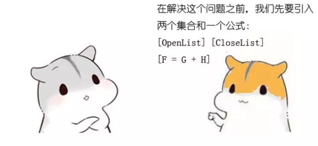
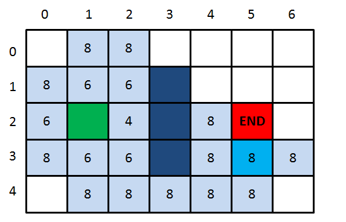

# A星寻路算法，讲解1

原文地址：[https://mp.weixin.qq.com/s?__biz=MzIxMjE5MTE1Nw==&mid=2653191389&idx=1&sn=c1728de0464bfc00931fe2c36812a80a&chksm=8c990e07bbee87115480d733a869044183422deb39397dc3a06bf637d7f66639f2c2bbeec71d&mpshare=1&scene=23&srcid=0907yivB2WUR1GULxqOozYsm&sharer_sharetime=1599481803923&sharer_shareid=bcd951b302640a211da09211b777f459#rd](https://mp.weixin.qq.com/s?__biz=MzIxMjE5MTE1Nw==&mid=2653191389&idx=1&sn=c1728de0464bfc00931fe2c36812a80a&chksm=8c990e07bbee87115480d733a869044183422deb39397dc3a06bf637d7f66639f2c2bbeec71d&mpshare=1&scene=23&srcid=0907yivB2WUR1GULxqOozYsm&sharer_sharetime=1599481803923&sharer_shareid=bcd951b302640a211da09211b777f459#rd)

