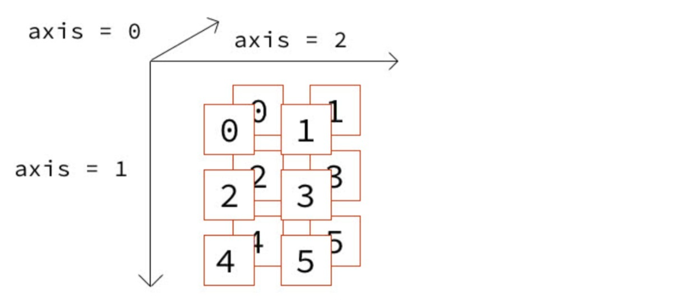

# Numpy轴的概念

看这个文章前，建议先看看《关于transpose》那个网页

这个文章主要想，让你看文章里的这张图片

### 案例

```python
import numpy as np
b = np.array([[[0, 1],
               [2, 3],
               [4, 5]],
              [[0, 1],
               [2, 3],
               [4, 5]]])
print(b.shape) # (2, 3, 2)
#分别对应轴        0, 1, 2
```



```python
'''
0轴
0，0
1，1
2，2
3，3
4，4
5，5
'''

'''
1轴
0，2，4
1，3，5
0，2，4
1，3，5
'''

'''
2轴
0，1
2，3
4，5
0，1
2，3
4，5
'''

# 验证：
# print(b.sum(axis=0))
'''
[[ 0,  2],
 [ 4,  6],
 [ 8, 10]]
-------------------
[[ 0+0=0,  1+1=2],
 [ 2+2=4,  3+3=6],
 [ 4+4=8,  5+510]]
'''
# print(b.sum(axis=1))
'''
[[6 9]
 [6 9]]
-------------------
[[0+2+4=6 1+3+5=9]
 [0+2+4=6 1+3+5=9]]
'''
# print(b.sum(axis=2))
'''
[[1 5 9]
 [1 5 9]]
-------------------
[[0+1=1 2+3=5 4+5=9]
 [0+1=1 2+3=5 4+5=9]]
'''
```


