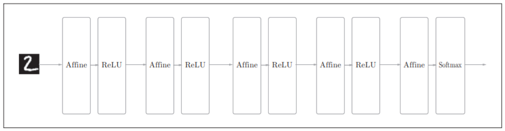
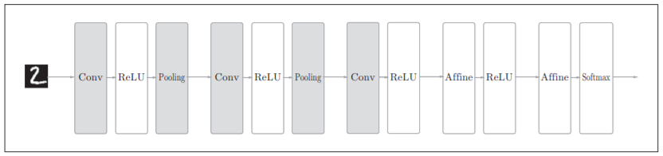
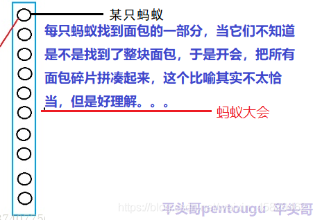
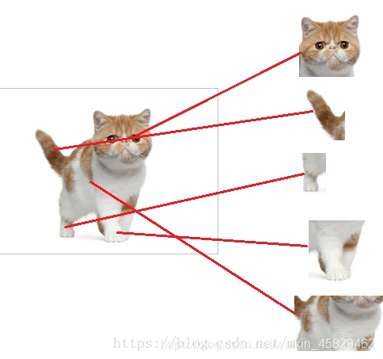
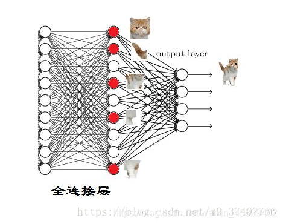
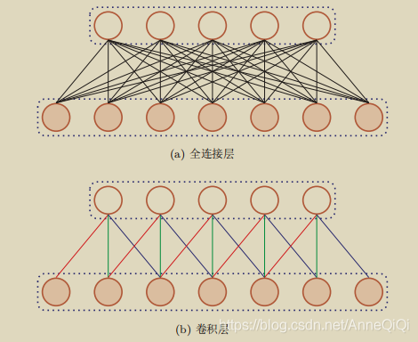
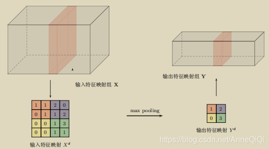
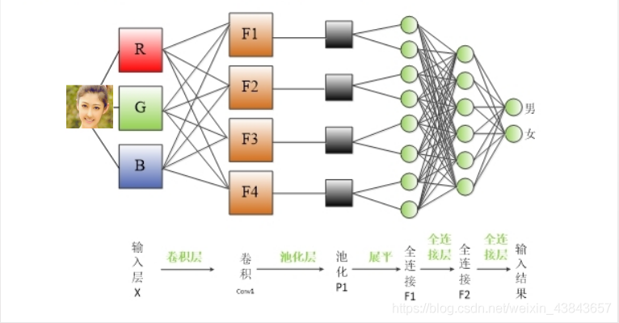

# 卷积神经网络 `（Convolutional Neural Network，CNN）`

## 本节内容涵盖书的：7.1 - 7.2.1

这章之前学习的网络，叫“全连接神经网络”。在全连接的神经网络中，相邻层的所有神经元之间都有连接，所以被称为全连接（fully-connected）。另外，我们用Affine层实现了全连接层。

全连接神经网络结构：

上面图片是一个5层的全连接神经网络，在这个全连接的神经网络中，Affine层后面跟着激活函数ReLU层（或者Sigmoid层）。这里堆叠了4层“Affine-ReLU”组合，然后第5层是Affine层和Softmax层的组合，第5层的激活函数“Softmax层”负责输出最终结果（概率）。(第五层的Softmax激活函数，还有另外一个名字，叫输出层激活函数)

---

这章将要学习的网络，叫“卷积神经网络” 简称CNN，CNN和之前介绍的神经网络一样，可以像乐高积木一样通过组装层来构建。不过，CNN中新出现了卷积层（Convolution层）和池化层（Pooling层）

CNN网络结构：

CNN 中新增了 Convolution 层 和 Pooling 层（图片里，用灰色方块表示的就是新增的Convolution层和Pooling层）。CNN 的层的连接顺序是“Convolution - ReLU -（Pooling）”（Pooling层有时会被省略）。这可以理解为之前的“Affine - ReLU”连接被替换成了“Convolution - ReLU -（Pooling）”连接。

还需要注意的是，在上边的图片中，CNN网络结构里，靠近 输出层 的 层中使用了之前的“Affine - ReLU”组合。还有，最后的输出层中使用了之前的“Affine - Softmax”组合。

---

全连接网络 和 CNN网络有哪些不一样：

CNN各层中传递的数据是有形状的数据（比如，3维数据）

全连接网络 与 CNN网络 进行比较，所存在的问题是，数据的形状被“忽视”了。比如，输入数据是图像时，图像通常是有高、长、通道方向上的3维形状。但是，向全连接网络输入时，需要将3维数据拉平为1维数据。前面提到的使用MNIST数据集的例子中，输入图像就是1通道、高28像素、长28像素的（1, 28, 28）形状，但却被排成1列，以784个数据的形式输入到最开始的Affine层。

CNN中输入的数据是有形状的数据，如图像是3维形状，这个形状中应该含有重要的空间信息。比如，空间上邻近的像素为相似的值、RBG的各个通道之间分别有密切的关联性、相距较远的像素之间没有什么关联等，3维形状中可能隐藏有值得提取的本质模式。但是，全连接层会忽视形状，会将全部的输入数据作为相同的神经元（同一维度的神经元）处理，所以无法利用与形状相关的信息。

CNN网络的卷积层可以保持形状不变。当输入数据是图像时，卷积层会以3维数据的形式接收输入数据，并同样以3维数据的形式输出至下一层。因此，在CNN中，可以（有可能）正确理解图像等具有形状的数据。

---

CNN网络中，全连接层的作用：全连接层在CNN网络中起到“分类器”的作用（通过特征提取，实现分类）。

[全连接层详解](https://blog.csdn.net/weixin_45829462/article/details/106548749)

1、假设你是一只小蚂蚁，你的任务是找小面包。但你的视野还比较窄，只能看到很小一片区域。当你找到一片小面包之后，你不知道你找到的是不是全部的小面包，所以你们全部的蚂蚁开了个会，把所有的小面包都拿出来分享了。全连接层就是这个蚂蚁大会

2、我们现在的任务是去区别一图片是不是猫

假设这个神经网络模型已经训练完了，全连接层已经知道

当我们得到以上特征，我就可以判断这个东东是猫了。

因为全连接层的作用主要就是实现分类

红色的神经元表示这个特征被找到了（激活了）

同一层的其他神经元，要么猫的特征不明显，要么没找到

当我们把这些找到的特征组合在一起，发现最符合要求的是猫

ok，我认为这是猫了

这细节特征又是怎么来的？

就是从前面的卷积层，下采样层来的

---

CNN网络中，卷积层 和 池化层 的作用：

卷积层

[卷积层，池化层，全连接层的理解](https://blog.51cto.com/u_10055401/5482385)

[如何理解卷积神经网络（CNN）中的卷积和池化？](https://www.zhihu.com/question/49376084)

[卷积神经网络中卷积层和池化层的作用](https://blog.csdn.net/weixin_43843657/article/details/89138646)

1、卷积层最主要的作用就是，获取输入图片的特征。

2、局部感知：人的大脑识别图片的过程中，并不是一下子整张图同时识别，而是对于图片中的每一个特征首先局部感知，然后更高层次对局部进行综合操作，从而得到全局信息。

3、卷积层中使用的滤波器，通常称为垂直**索伯滤波器**（Sobel filter）

当输入图片，被应用滤波器后，看看输出图片会得到什么？

看出来了吗？其实，索伯滤波器就是边缘检测器

被应用滤波器运算的图像，在输出图像里，更亮的像素表示原始图像中存在的边缘。

所以，卷积有助于我们找到特定的局部图像特征（如边缘）

池化层

[CNN中卷积层和池化的作用和理解](https://blog.csdn.net/AnneQiQi/article/details/103577321)

1、池化层（pooling layer)也叫做子采样层（subsampling layer），其作用是进行特征选择，降低特征数量，并从而减少参数数量。

2、卷积层【局部连接和权重共享】虽然可以显著减少网络中连接的数量，但特征映射组中的神经元个数并没有显著减少。如果后面接一个分类器，分类器的输入维数依然很高，很容易过拟合。为了解决这个问题，可以再卷积层之后加上一个pooling layer，从而降低特征维数，避免过拟合。

3、卷积层【局部连接和权重共享】，暂时没看明白，到后面卷积反向传播时，在研究，这里只需要，明白大概意思就行，不必细究，等反向传播时在细究

