# 导数

## 导数的概念1
[原文章地址](https://www.jianshu.com/p/9c7ca7fe2a33)

### 导数有什么用？

用下面的图来说明导数是什么

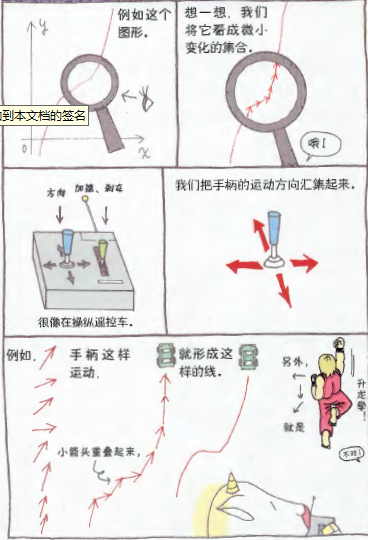

### 某一点的斜率和瞬间斜率

课本上讲了函数的瞬时变化率，但是对于同学们来说，这个讲法太不好理解。我们还是用，解析几何里面经常讲的斜率来说比较好。

前面说了，导数的目的是分析变化。突然提出“变化”，你可能无法理解，我们以过山车为例来说明一下。

过山车的车道多为曲线，因此我们可以认为乘坐者是在过山车的轨道曲线上移动。过山车向下俯冲、水平前行、向上攀升，在不同的地点，乘坐者的身体会产生拉、拽或失重等不同感受。

这种状况出现的重要原因之一，就是身体的方向和速度发生了变化。过山车的轨道为曲线，乘客在轨道上任意一点的方向和趋势都不相同。

以数学思维来思考该话题的话，函数图形中的曲线就相当于过山车轨道，图形上的点就是飞驰在轨道上的过山车。试着描绘一下过山车在曲线各点上的运动趋势，会发现它们都朝着各自不同的方向前进。只是不知道图形上点的移动速度而已。

从数学角度考虑点在曲线上的移动，会将该点在下一个瞬间发生的变化称为“瞬间斜率”。换言之，瞬间斜率就是曲线上各点的斜率。后面我们会进一步详细阐述。

数学上在设定斜率时，都是取两个点，这与“某一点的斜率”的说法有些矛盾，因此有时会使用“瞬间斜率”的说法。而正因如此，有些令人费解。导数这个概念原本是从物理学和天文学这类研究物体运动的学科发展而来的，在这些领域里，“瞬间”或许是十分平常的现象，但针对没有运动概念的数学曲线图形谈“瞬间”，有人就无法理解。因此，我们使用数学化、图形化的方式进行讲解，不使用“瞬间斜率”的表述方法，而代之以“某一点的斜率”。已经习惯使用瞬间斜率的同学，请转换一下概念，“某一点的斜率=瞬间斜率”。初次接触导数的同学也请记住瞬间斜率是常用说法。

用普通的方法很难求某一点的斜率，使用导数却能轻松求出来，请牢记这一点。

如果轨道瞬间消失了，那么急驰在上面的过山车会怎样？答案是：会沿直线飞出去，此时过山车飞出的方向就是曲线的切线方向。因此“瞬间斜率”或“某一点的斜率”也可用于求切线的斜率。

### 如何画曲线？

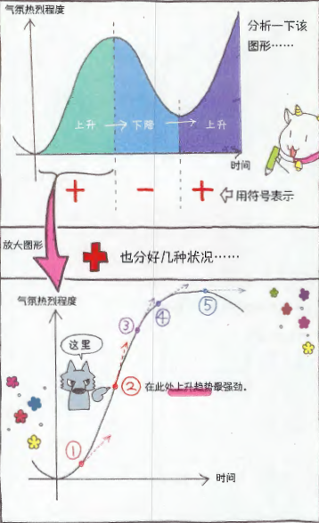

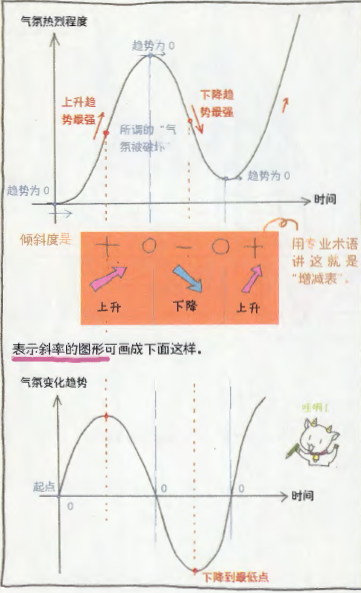

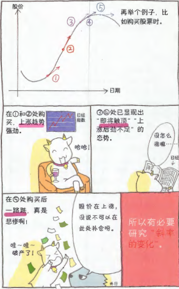

----------

## 导数的概念2
[原文章地址](https://www.jianshu.com/p/338f69f20d6a)

### 解析几何里面如何求斜率

你还记得学数学时第一次听说斜率是什么时候吗？

斜率一词是在学习正比例函数时出现的，看来我们和斜率的渊源颜深响。

想想看，学习正比例函数时，是用什么方法求斜率的。

为了求斜率，首先要在直线上选取两点绘制一个三角形。取两点的纵向差和横向差，用纵向差除以横向差就得到斜率。数学上的斜率表示为“纵向长度差÷横向长度差”。（日常生活中多用角度表示斜率，但角度不易计算，所以不常使用。）

这是求斜率的基本方法，是一个基本的计算原则。

但是求曲线的斜率却不能直接使用这种方法。曲线弯弯曲曲，不能任取两点组成三角形，因为无法确定要求哪个点的斜率。而如果是直线的话，无论在哪儿取两点，计算出的斜率都是一定的。

那曲线如何取点比较好？如何取点才能求出准确的斜率？都是很难的问题。

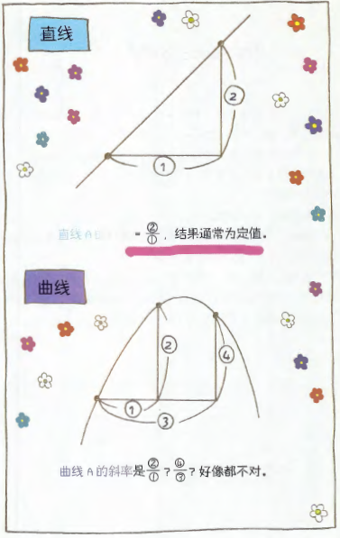

### 怎样在曲线上取两点

求斜率的基本方法就是取两点、连线，之后用两点间的“纵向长度差”除以“横向长度差”。

无论是直线还是曲线，这一原则都不会改变。也就是说，在求曲线上某个点的斜率时，仍需找到两个点。但实际上找到两个点是不可能的。

不可能，又必须找出来，怎么办好呢？

例如，我们要求右页图中A点的斜率。为此需要先找到两个适当的点。

我们在曲线上取点P和点Q，将点A夹在中间。连接点P和点Q得到直线PQ。因PQ是直线，求它的斜率很容易。之后我们使点P和点Q从左右两侧尽可能靠近点A。这样，最终就会出现一条与点A紧紧相连的直线，数学上称之为曲线在点A的切线。

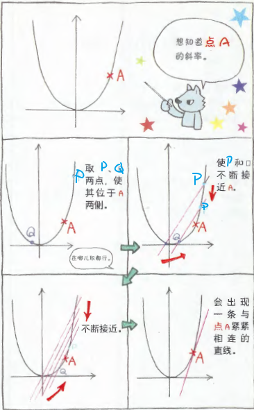

### 使曲线上的两点不断接近

在曲线上取两点时，要使其尽可能靠近点A。

“但是两点无限接近时的斜率究竟该怎么求呢？”“两点无限接近最终不就成为一点了吗？这也不是两点呀？……疑问随之而来。

事实确实如此。如果它们完全重叠，就成为“一个点”了。

但如果是非常接近呢？间距为1微米、1纳米或更近…实际上确实是两点，但看起来却像一个点。

这种“使两点无限接近”、“不重叠但使其无限靠近”的数学式思维方法就是极限理念。

求某一点的斜率和求导离不开极限概念。

因此，接下来我们要稍稍偏离导数，先来谈谈极限。

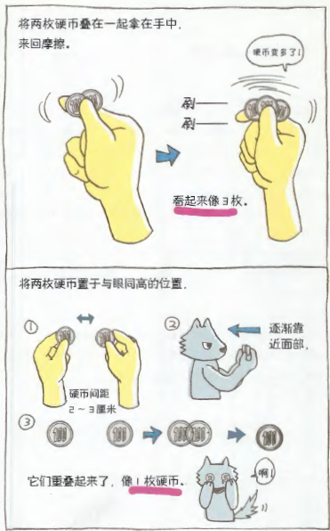

----------

## 导数的概念3
[原文章地址](https://www.jianshu.com/p/d0b1248438c0)

### 什么是极限

我们先来确认一下数学中极限一词的含义。

日常生活中常用极限一词表示极限状态。所谓极限状态就是

“已经没有余地了”、“再不可能了”这种接近界限的感觉。比如，暑假到最后一天了，但作业还没有做，憋不住了却找不到厕所…

此时通常人们都会想：“不行了！不行了！”

我想大家都有过类似的经历。其实想尽量避免的困窘状态就是一种极限状态。

那数学中的极限是否与此相同呢？

如果极限表示“不行了”、“到头了”，那么此时应该是无法解决数学问题才对。

数学的极限是怎样一种感觉呢？

请想象一下高尔夫球的比赛，球可以距离球洞多近：还有在10秒钟速算比赛中，选手感觉到的时间与实际时间的差距有多短，这些比赛都是在考察“能在哪种程度上接近目标”。

数学中的极限就包含有“尽可能接近”这一积极的含义。

### 什么是无限接近

某物（数值）向他物（数值）无限接近的状态可用下面这个算式表示。

我突然写出个算式来，你是不是感觉有些惊讶？这个算式表示“当x无限接近a，f（x）就会接近b”。有人可能会说：“你怎么突然讲这么抽象的事，实在……”那么我一点点来解释。

首先是lim，它是limit的缩写。limit有极限之意，lim下写的小字表示“使什么向什么靠近”，因此上面那个算式的意思就是“使x向a靠近”。在讲述计算方法之前，我们先举例找找感觉。

找到点感觉了吗？这是用啤酒饮用量函数表示醉酒程度，意思是“啤酒喝到接近10杯，人就接近烂醉状态”。下面的例子比较严肃，但也可以找到些感觉。

这是表示疲劳程度的函数式。意思是“越接近每天加班，因过度疲劳而病倒的日子越近"。

综上所述，一个值无限接近另外一个值的状态就是极限。不会计算没关系，能够找到这种感觉就可以了。

### 怎样用数学算式表示极限

找到极限的感觉后，这次我们试试从数学的角度来研究极限。

请看看下面的算式。

例1：

算式表示“使n无限接近1”。n无限接近1，则1-n无限接近1-1，也就是无限接近0。再看下一个。

例2：

n无限接近1，则  无限接近 ，也就是无限接近1.

再来个难一些的。

例3：

难度 增加了，但只要按相同方式思考就可以迎刃而解。n无限接近1，则  无限接近  ,也就是0.因此结果是无限接近0。

最后一个。

例4：

与前三个不同，这个可没那么简单。分子与前一个算式相同，接近于0，但分母也接近于0.

咦，答案是  ?有分母为0的分数吗？没有。0为分数违反了算术规则，这样的分数不存在。

那该怎样好呢？实际上这个分数的分子可以因式分解。

分子分母中都含有n-1,可以进行约分。

准确地说，因为lim情况下，n-1无限接近于0，但并不等于0，所以可以进行约分。

约分后剩下n-2,所以答案是无限接近-1。

最后一道题稍有些专业，目的是先让大家简单接触一下计算。

----------

## 导数的概念4
[原文章地址](https://www.jianshu.com/p/daaf974f2d16)

### 开始计算斜率

前面谈了一下极限的问题。你还记得我们为什么要谈极限吗？

前面说过，导数是求函数斜率的工具。

斜率是什么？一次函数的斜率不言而喻是直线。二次以上函数的图形是曲线，曲线的斜率是什么？此时我们可以考虑切线的斜率。

那切线的斜率该如何计算呢？

斜率原本是“纵向长度差÷横向长度差”，但是曲线图形的切线仅与曲线上的一点相连，那么纵向长度差是什么，横向长度差又是什么？？

由此人们产生了这样的设想——适当选取两点，并使它们逐渐接近，那么它们最终会成为一点。为了实现这一设想，极限概念应运而生。

想起来了吗？

那么我们就从下一页开始讲讲斜率的具体计算方法。现在，进入正题了。

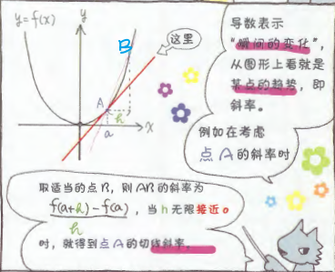

### “滑动着”求导

好了，我们接着讲。

假设我们要求函数f（x）图形上点A的斜率。设点A的坐标为（a，f（a））。

就像我反复强调的那样，只有一点是无法求斜率的（无法取纵向长度差和横向长度差），因此我们要在附近再取一点B。假设点B比点A的x坐标值略大，x坐标值的差为h，则B点坐标为（a+h，f（a+h）。

我们来求一下AB的斜率。斜率为“纵向长度差÷横向长度差”，纵向长度差为f（a+h）-f（a），横向差为h。

AB的斜率= 

现在想求的是点A的斜率。如何将AB的斜率与点A的斜率联系起来呢？我们让点B沿曲线向点A滑动，即让点B接近点A，最终两点重合，此时AB的斜率就变成A点的斜率了。

可是，如果点A和点B重合，h就为0了，斜率算式的分母为零，这样不行呀。

别忘了，我们不是为此而引入了极限吗？

是呀，h不断接近0，则……

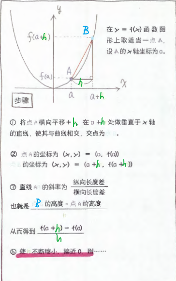

根据上面的分析，

如此就求得了点A的斜率。啪啪啪（鼓掌）。

这就是导数。

准确来说，上面的算式应叫f（x）在点x=a处的导数。

之前已经说过，点A不是f（x）上某个特殊的点，而是任意一点。也就是说，无论取f（x）上的哪个点都没问题。尝试将a置换为x，则得到

这就是f（x）的求导公式。

让我们来使用一下这个公式，算算  在点A（2，4）处的斜率。将A点坐标代入上式，则

巧妙地约掉h是解题的关键（记住h是不会等于0的）。最后得到答案是4。也就是说，点A（2，4）处的斜率为4。

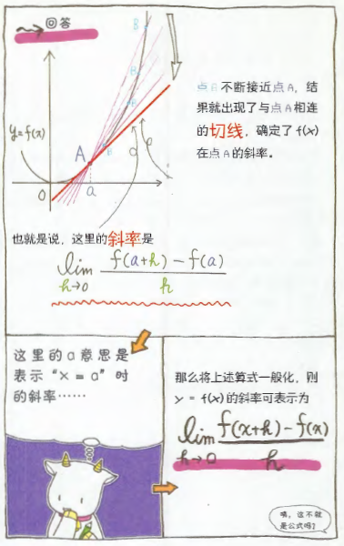

### 求某一点斜率的意义

我们已经知道了求某点斜率的方法，那么使用该方法可以做些什么呢？

好不容易找到了一个便利的工具，现在好想知道该如何使用。在导数的众多用途中，使用须率最高的是绘制切线和图形。使用导数绘制切线非常方便。用导数可以求斜率，知道斜率，再知道该点的坐标，马上就能写出切线的方程。

运用导数还能绘制出曲线的大致形状。通常来说，没有电脑和专业人士的帮助很难精确绘制出曲线的图形。但使用导数可以求出曲线发生转折的极限值点和弯曲状态发生变化的拐点。例如，假设在图形上取适当两点，一点的斜率为正，另一点的斜率为负。如果该曲线是流畅的，那么它们中间必然会有斜率为0的地方。

也就是说，如果能求导找到斜率为0的点，就能大致绘制出图形形状。这是使用导数最大的优点。

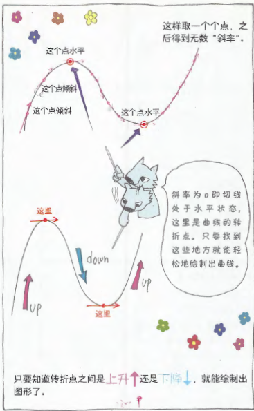

