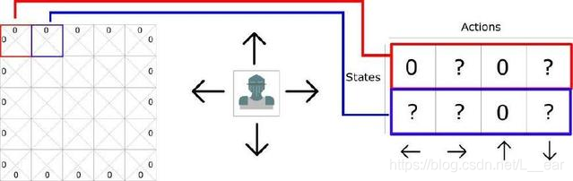

# 强化学习算法Demo讲解

原文地址：[https://blog.csdn.net/L__ear/article/details/103880225](https://blog.csdn.net/L__ear/article/details/103880225)

## 强化学习Q learning算法最简单的入门（含java实现的小例子）

## 一、强化学习
强化学习和遗传算法优胜劣汰的思想类似，通过奖惩机制不断强化好的行为（action），弱化坏的行为。至于什么是好的行为，什么是坏的行为，跟你要解决的具体问题有关，比如路径规划问题，走距离目标点较近的路线就是好的行为，走距离目标点较远的路线就是坏的行为。

强化学习包含四要素：agent、环境状态、动作和奖励，**目标是获得最多的累计奖励**。

## 二、Q learning
Q learning 融合了马尔科夫过程和动态规划，使用贝尔曼方程求解马尔科夫过程。今天我们不展开讲马尔科夫过程和贝尔曼方程，因为那样入门起来就不简单了，今天仅从算法过程的角度理解并入门，马尔科夫过程和贝尔曼方程是入门后再去深入研究的原理性部分。

Q learning 最重要的数据结构为 Q 表，Q 是 quality 的缩写。算法最终就是要学习到一张好的 Q 表，这样我们就可以根据 Q 表对环境中的任何情况（状态）都能给出一个好的反应（动作）。具体的，就是每次都选择 Q 表中对应状态下具有最大 Q 值的动作。


Q 表一般用二维数组表示，**每一行表示一个状态，每一列表示一个动作**。 例如上图所示的基于移动的二维游戏，每个状态（方块）有四个动作：左移、右移、上移、下移。



0 代表不能向对应方向移动的地形边缘。

算法流程图：


伪码描述：
```javascript
初始化Q表
while Q表未收敛:
	初始化状态s，开始新一轮训练
	while s != 目标状态
		使用策略（E-greedy）获得动作a
		执行动作转换到下一个状态s1，并获得奖励r(s,a)
		Q[s,a] = (1-alpha)*Q[s,a]+alpha*(r(s,a)+gamma*max(Q[s1])) // update Q
		s = s1
```

后面我们会有一个和这个伪码描述完全一致的 java 实现，可以对比理解。

看完伪码描述后，我们的脑海里可能会有两个迫切想要了解的点。

## 关键点一：更新公式如何理解？


奖励由两部分组成：

1、眼前的奖励；
2、未来的奖励，**衰减因子 γ ∈ ( 0 , 1 ) \gamma\in(0,1) γ∈(0,1) 表示对未来奖励的重视程度**；
新的 Q 值是旧的 Q 值和奖励的凸组合，换句话说就是新的 Q 值一定介于旧的 Q 值和奖励之间。

因为奖励中包含未来的奖励，所以如果未来收益很小，说明照此发展下去，未来不容乐观，Q 值就会变小，下次在状态 s 下选择动作 a 的可能性就会变小。

相反的，如果未来收益很大，Q 值就会变大，下次在状态 s 下选择动作 a 的可能性就会变大

## 关键点二：使用策略（ ϵ \epsilon ϵ-greedy）获得动作，使用什么策略？为什么？
Q 表训练完成后，我们可以每次都选择 Q 表中对应状态下具有最大 Q 值的动作作为决策。但是在训练过程中，这样选择动作是否合理呢？

答案是不合理，为什么，因为在初始阶段，Q 表中大部分的值还没更新，普遍比较小。一旦找到一个可以到达目标状态的策略（往往不是最优的），那么以后每次按照最大值决策，就都会使用那一个策略，因为其它 Q 值都比较小，没有机会被选择到。所以在训练过程中过于贪婪（greedy）的使用 Q 表选择动作，很容易陷入局部最优，并且跳不出来。

一般在训练时，通过 epsilon（ ϵ \epsilon ϵ）参数控制 agent 的贪婪程度，例如 epsilon = 0.9，表示 90% 的时间使用 Q 表做决策，10% 的时间随机选择动作来探索未知的环境。

## 三、java 实现的小例子

一个简单的不能再简单的小例子。

问题：最短路径，寻找起始点A到目标点D的最短路径。


```javascript
package main;
import java.util.Arrays;
public class Qlearning {
	public static void main(String[] args) {
		double[][] Q = new double[][] {
			{-1,  0,  0, -1},
			{-1, -1, -1,  0},
			{-1, -1, -1,  0},
			{-1, -1, -1, -1}
		};
		
		int[][] graph = new int[][] {
			{0, 3, 2, 0},
			{0, 0, 0, 1},
			{0, 0, 0, 4},
			{0, 0, 0, 0}
		};
		
		double epsilon = 0.8;
		double alpha = 0.2;
		double gamma = 0.8;
		int MAX_EPISODES = 400; // 一般都通过设置最大迭代次数来控制训练轮数
		for(int episode = 0; episode < MAX_EPISODES; ++episode) {
			System.out.println("第"+episode+"轮训练...");
			int index = 0;
			while(index != 3) { // 到达目标状态，结束循环，进行下一轮训练
				int next;
				if(Math.random() < epsilon) next = max(Q[index]); // 通过 Q 表选择动作
				else next = randomNext(Q[index]); // 随机选择可行动作
				
				int reward =5 - graph[index][next]; // 奖励
				Q[index][next] = (1-alpha)*Q[index][next] + alpha*(reward+gamma*maxNextQ(Q[next]));
				index = next; // 更新状态
			}
		}
		System.out.println(Arrays.deepToString(Q));
	}

	private static int randomNext(double[] is) { // 蓄水池抽样，等概率选择流式数据
		int next = 0, n = 1;
		for(int i = 0; i < is.length; ++i) {
			if(is[i] >= 0 && Math.random() < 1.0/n++) next = i;
		}
		return next;
	}

	private static int max(double[] is) {
		int max = 0;
		for(int i = 1; i < is.length; ++i) {
			if(is[i] > is[max]) max = i;
		}
		return max;
	}
	
	private static double maxNextQ(double[] is) {
		double max = is[0];
		for(int i = 1; i < is.length; ++i) {
			if(is[i] > max) max = is[i];
		}
		return max;
	}

}
```

Q 表的更新过程：


第三个 Q 表其实已经收敛。

Q(s,a)=(1−α)Q(s,a)+α(R+γ⋅maxQ(s′))

(1-0.2)* **4.56** + 0.2*(2+0.8*3.2)= **4.56**

(1-0.2)* **3.16** + 0.2*(3+0.8*0.2)= **3.16**

(1-0.2)* **3.2** + 0.2*(4-0.8)= 3.2

(1-0.2)* **0.2** + 0.2*(1-0.8)= 0.2

对照着公式，通过手工计算可以看到所有的 Q 值已经趋于稳定，继续迭代，Q 值也不会发生更新。

对比 Q 表的更新过程可以发现，刚开始时，还会选择 A->C 这条路径，因为短期从 A->C 能够获得更多的奖励，但是当接受到未来奖励的反馈后，开始逐渐倾向于 A->B，并最终选择 A-> B 路径，因为从 B->D 会获得比从 C->D 大得多的奖励。这也体现了强化学习**延迟反馈**的特征。

参数设置对模型的影响：

epsilon 过大，模型不容易收敛。
alpha 过小，模型不容易收敛。
gamma 改变最终的收敛结果也会改变。（强化学习的目的就是根据累计收益做决策，如果 gamma 过小，把眼前利益看的太重，不容易得到最优解）


