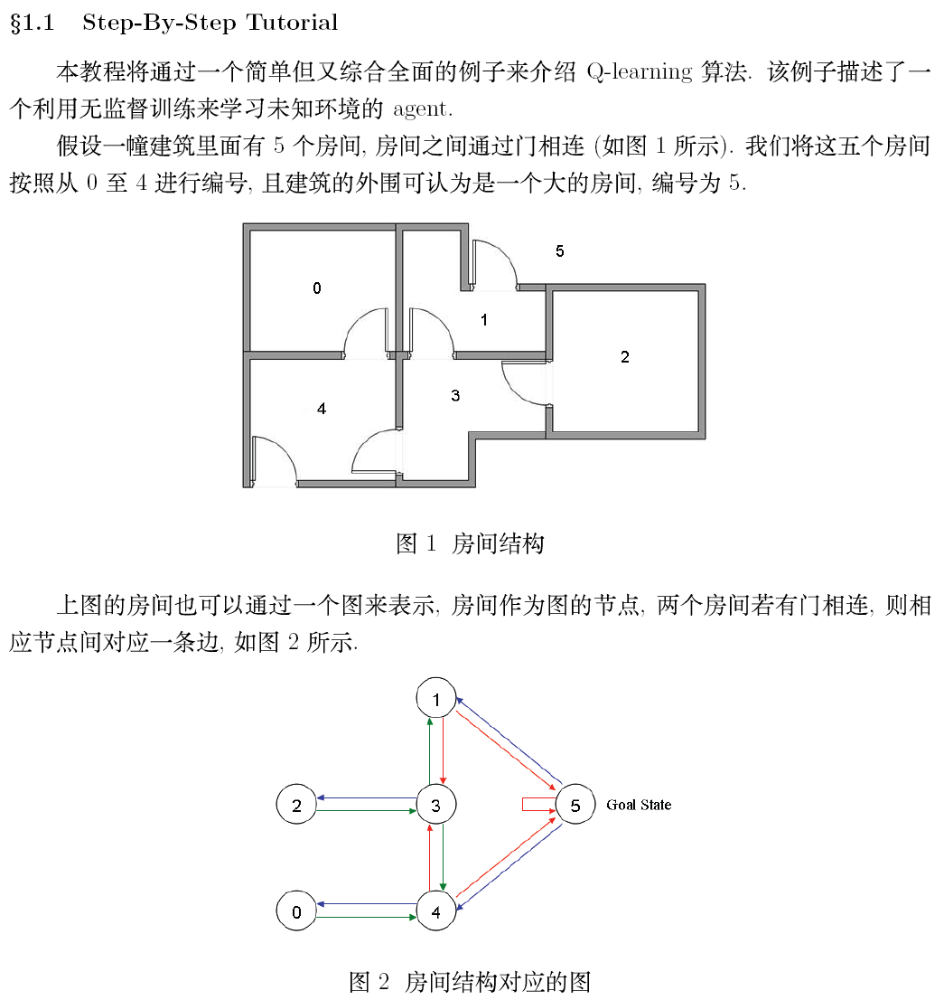
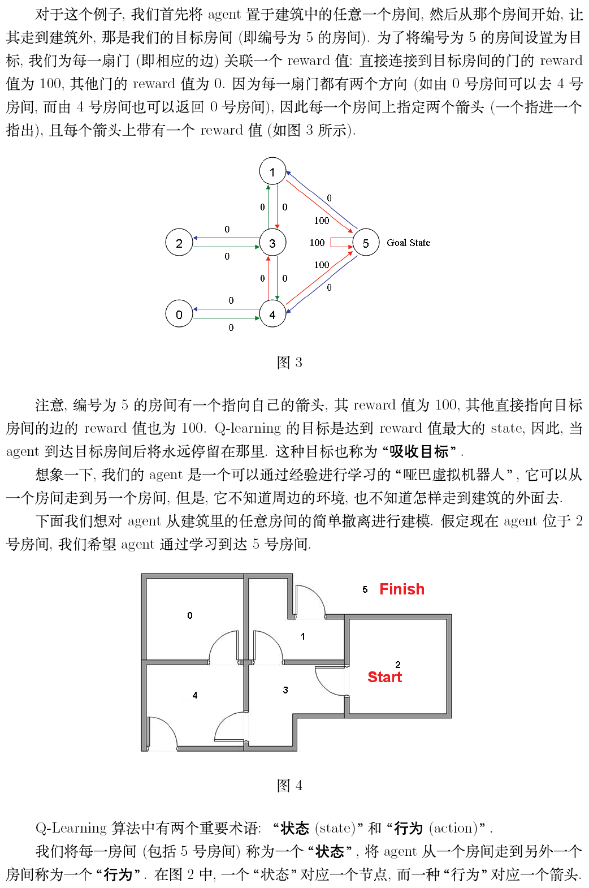
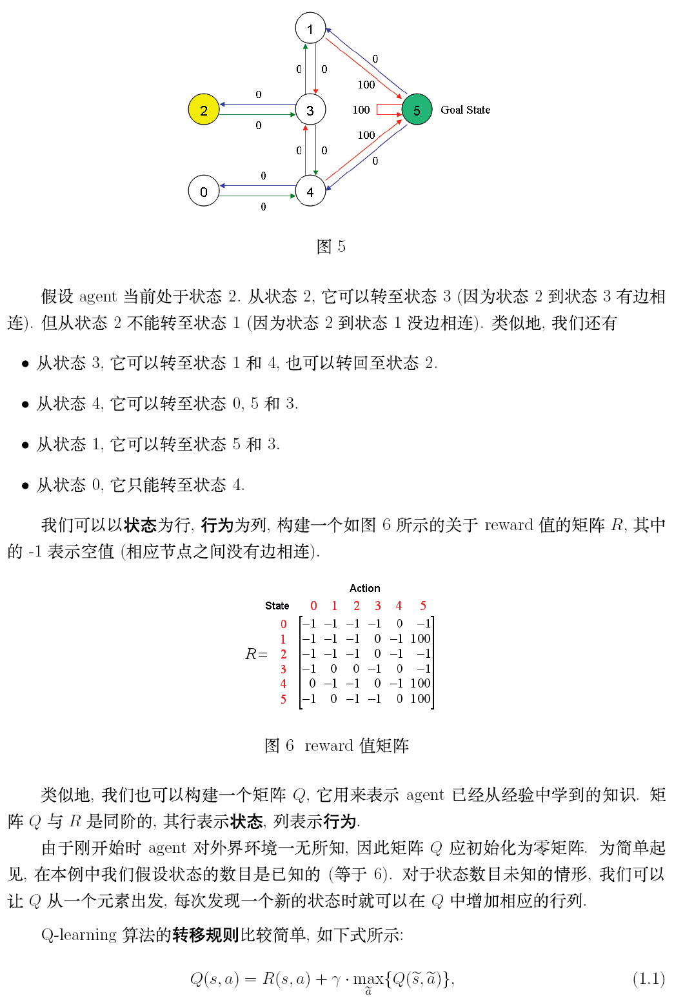
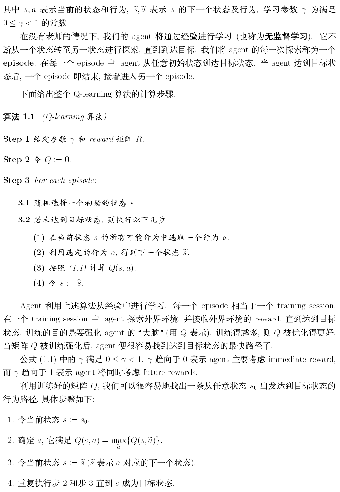
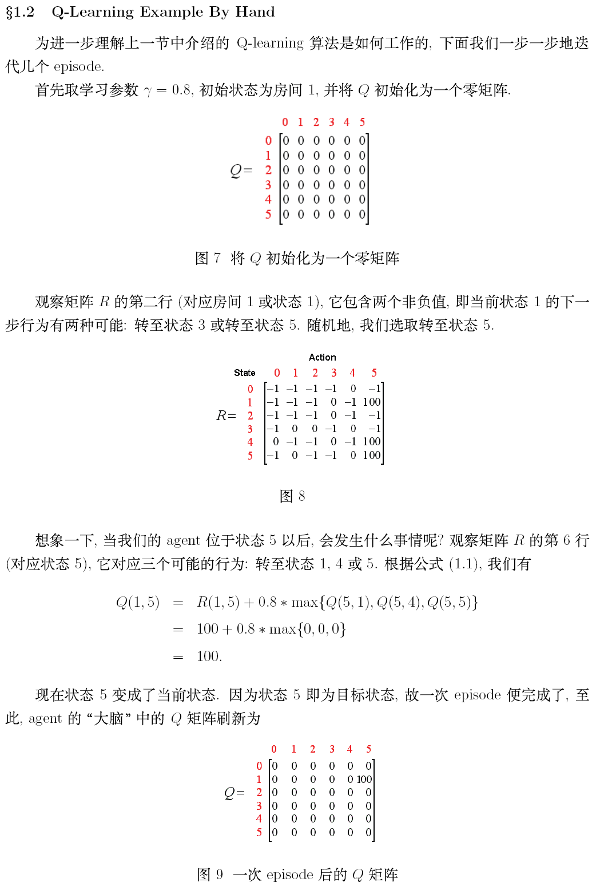
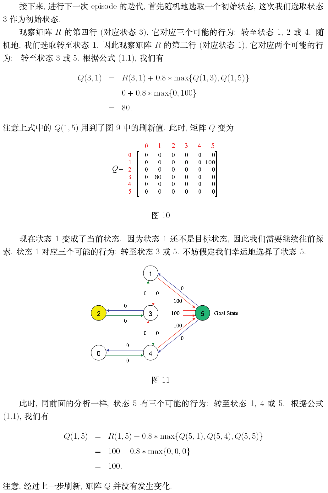
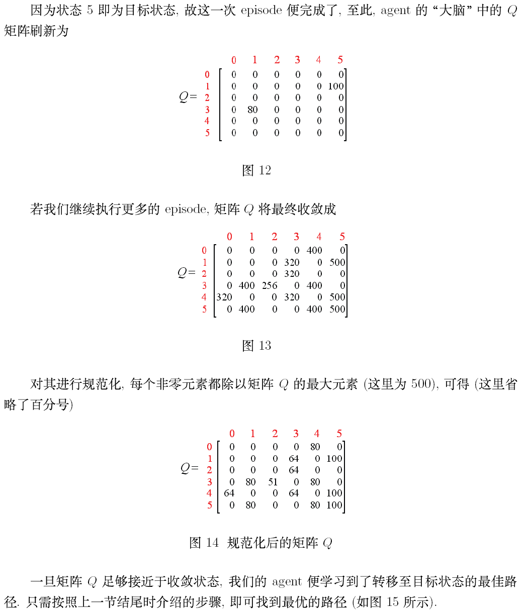
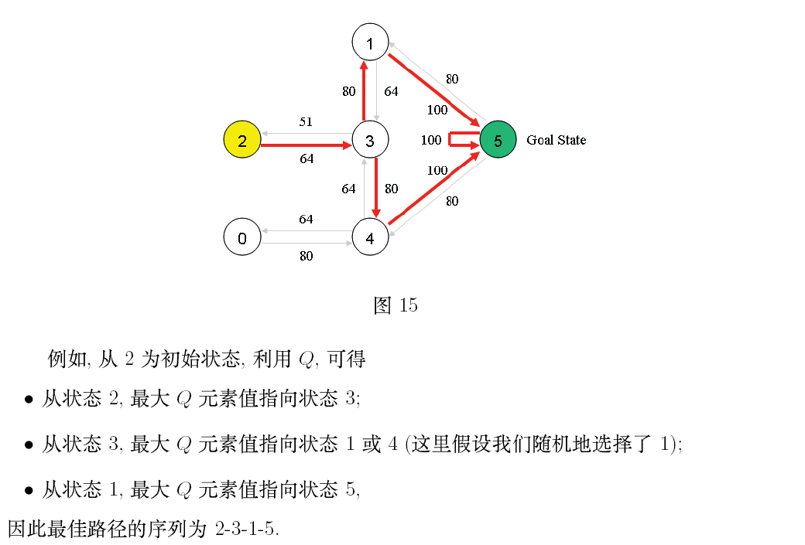

# 强化学习算法讲解2

原文地址：[https://blog.csdn.net/itplus/article/details/9361915](https://blog.csdn.net/itplus/article/details/9361915)

本文是对 http://mnemstudio.org/path-finding-q-learning-tutorial.htm 的翻译，共分两部分，第一部分为中文翻译，第二部分为英文原文。翻译时为方便读者理解，有些地方采用了意译的方式，此外，原文中有几处笔误，在翻译时已进行了更正。这篇教程通俗易懂，是一份很不错的学习理解 Q-learning 算法工作原理的材料。

## 第一部分：中文翻译

