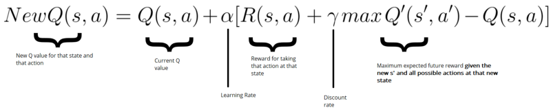
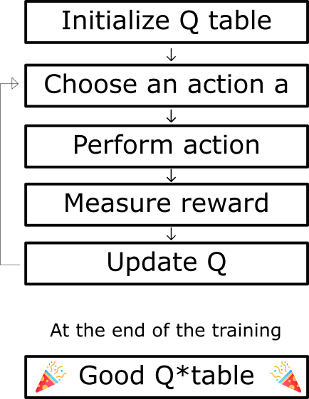
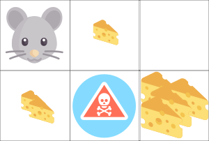
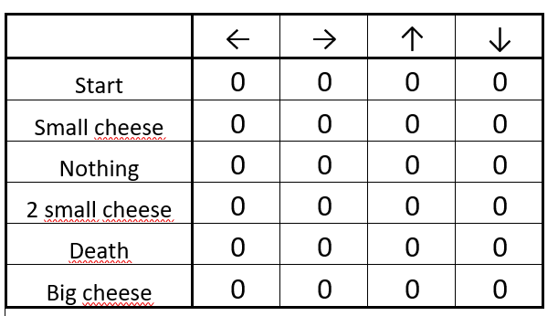
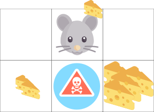
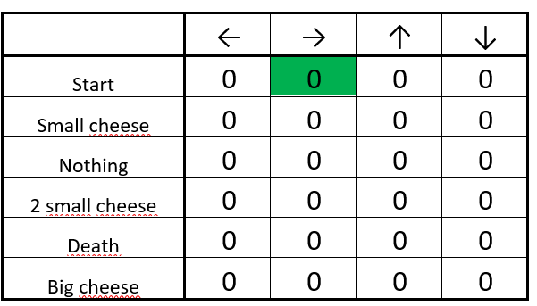
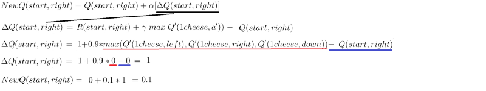
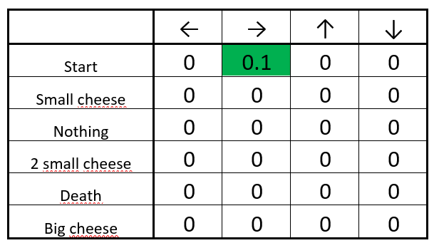

# 强化学习算法，讲解3

* 这篇文章的公式好用，算法逻辑看Demo2的文章。

原文地址：[https://www.freecodecamp.org/news/diving-deeper-into-reinforcement-learning-with-q-learning-c18d0db58efe/](https://www.freecodecamp.org/news/diving-deeper-into-reinforcement-learning-with-q-learning-c18d0db58efe/)

## 贝尔曼方程

```
NewQValue = CurrentQValue + lr * [Reward + discount_rate * (highestQValueBetweenPossibleActionsFromTheNewStateS’) — CurrentQValue]
```
## Q-Learning算法过程



## Let’s take an example


* One cheese = +1
* Two cheese = +2
* Big pile of cheese = +10 (end of the episode)
* If you eat rat poison =-10 (end of the episode)

## Step 1: We init our Q-table


(The initialized Q-table)

## Step 2: Choose an action
From the starting position, you can choose between going right or down. Because we have a big epsilon rate (since we don’t know anything about the environment yet), we choose randomly. For example… move right.



(We move at random (for instance, right))

We found a piece of cheese (+1), and we can now update the Q-value of being at start and going right. We do this by using the Bellman equation.

## Steps 4–5: Update the Q-function



* First, we calculate the change in Q value ΔQ(start, right)
* Then we add the initial Q value to the ΔQ(start, right) multiplied by a learning rate.

Think of the learning rate as a way of how quickly a network abandons the former value for the new. If the learning rate is 1, the new estimate will be the new Q-value.



(The updated Q-table)

Good! We’ve just updated our first Q value. Now we need to do that again and again until the learning is stopped.


